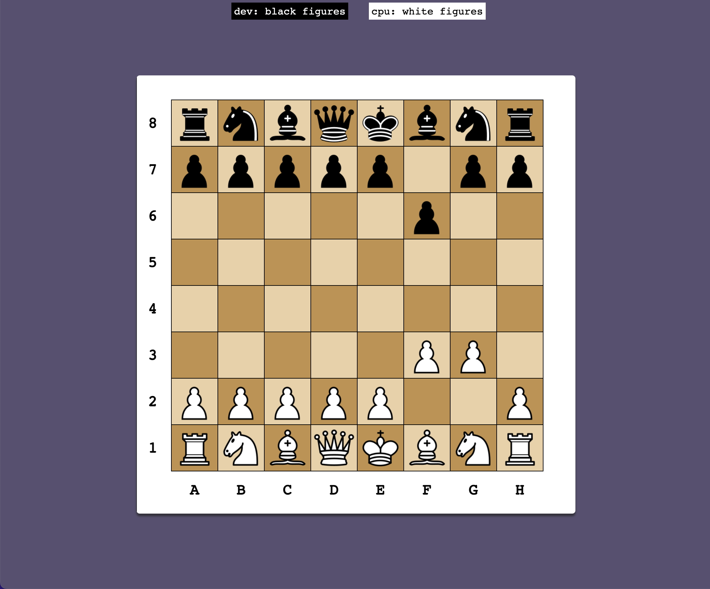
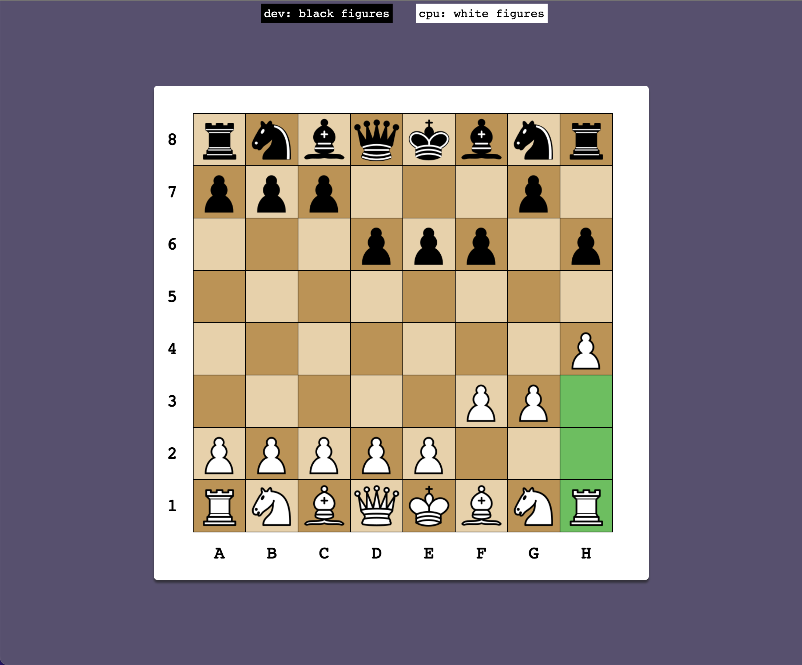
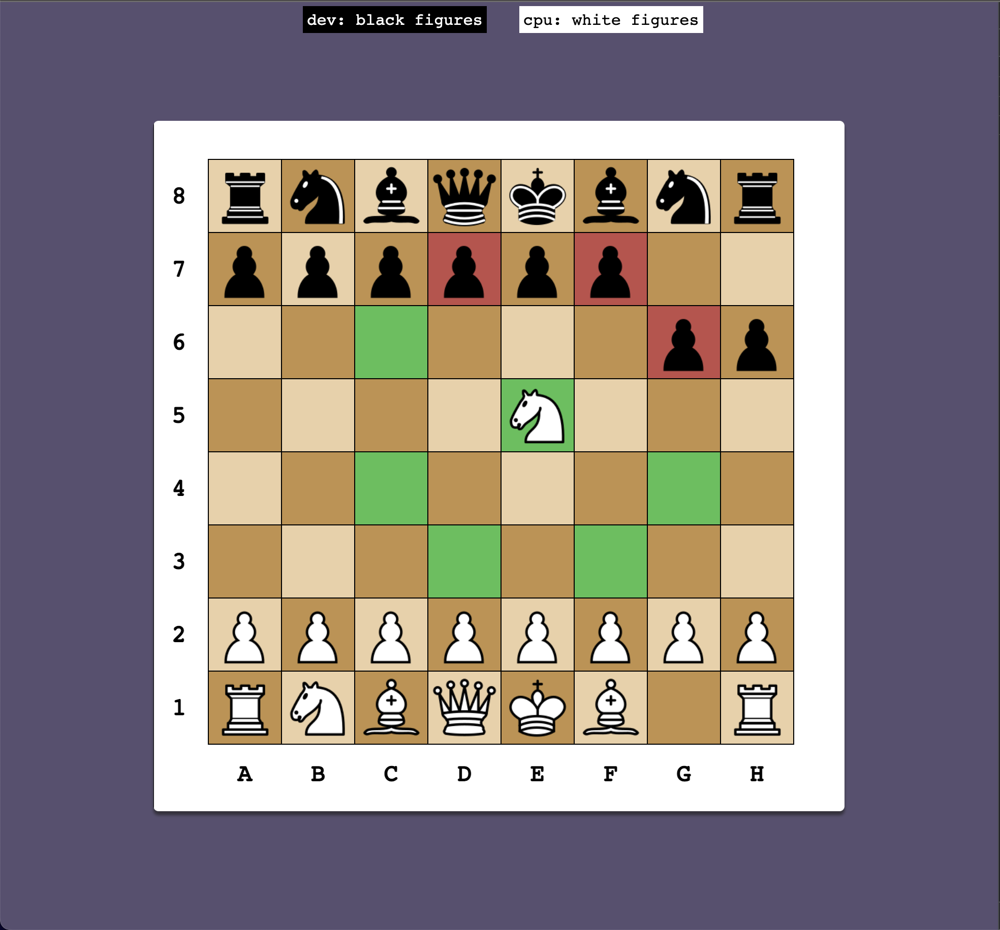

### Chess Game

  
<b>Screenshots</b>

#### TODO:

- [x] Movements
- [x] `Add`: Batch History
- [ ] `Improve`: Batch start & ui selection
- [ ] `Add`: End Game / New Batch
- [ ] `Add`: (Options) `current: 1vs1`, `1vsCPU/AI`
- [ ] `create` AI tensorflow
- [ ] `Refactoring` :)))